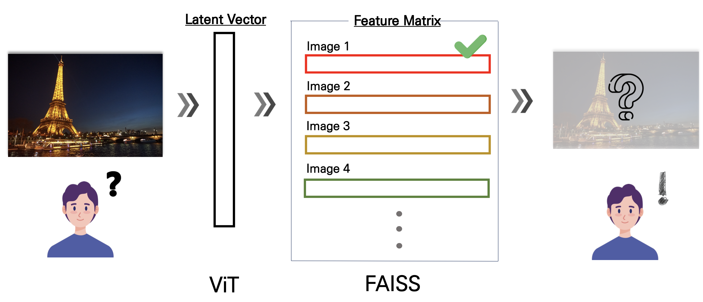

# 23-2_DSL_Modeling_each_team_project_name
---
## 해외 여행지 기반 국내 여행지 추천 모델
ViT를 활용하여 해외 여행지 이미지를 input하였을 때 비슷한 느낌의 국내 여행지를 추천해주는 모델입니다. 저희 모델을 사용하여 인상 깊었거나, 가보고 싶었던 해외 여행지와 비슷한 국내 여행지를 찾아보시길 바랍니다!
## Team E (RecSys)
**상** : 9기 전재병 <br>
**남** : 9기 김진하 <br>
**자** : 9기 이원준 <br>
**들** : 10기 김영호 <br>

---
# Overview
[발표자료](https://github.com/schritt4/23-2_DSL_Modeling_Tourist_Spot_Recommendation_with_ViT/blob/main/RecSys_E조.pdf)
## 1. Overall Pipeline
 <br>
* Latent Vector 추출을 위한 **ViT(Vision Transformer)**
* 유사한 Vector를 찾기 위한 **FAISS(Facebook AI Similarity Search)** 알고리즘 <br><br>
해외 여행지의 Latent Vector를 추출하고 국내 여행지의 Latent Vector와의 Cosine Similarity를 계산하여 가장 의미적으로 유사한 이미지를 선택
## 2. Model
(설명 마음대로, 발표자료 캡쳐 활용 등 자유롭게)
## 3. Dataset
## 4. ...필요하면 추가로 쓰기

# Result
## 1. Final Output
(결과 이미지 등)
## 2. Limitations and Future works
(의의, 한계, 발전방향 등등)

# End-to-End
(optional, 가능하다면 코드를 다시 실행해볼 수 있도록 코드 블럭을 활용하여 완성해주시면 좋을 것 같습니다.)
(ex)

```ruby
python run.py --config configs.txt
```

# File description
- main (실제 구동하는 파일)
  - ```main.py```  
- model (모델 내부 구조 파일)
  - ```encoder.py```
  - ```decoder.py```
- data (사용한 데이터 or 데이터 생성 파일)
(예시입니다! 각 팀의 프로젝트 파일 구조에 따라 자유롭게 완성해주세요)