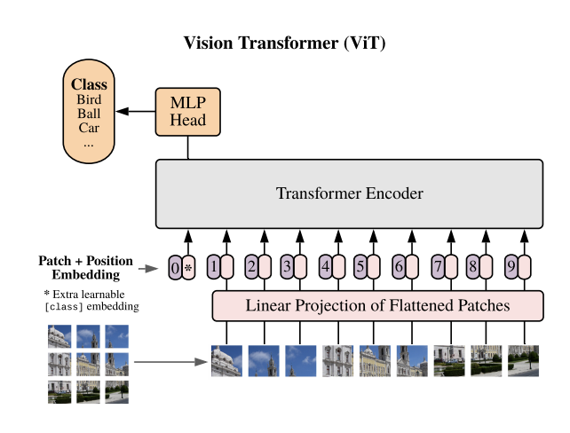

# 23-2_DSL_Modeling_each_team_project_name
---
## 해외 여행지 기반 국내 여행지 추천 모델
ViT를 활용하여 해외 여행지 이미지를 input하였을 때 비슷한 느낌의 국내 여행지를 추천해주는 모델입니다. 저희 모델을 사용하여 인상 깊었거나, 가보고 싶었던 해외 여행지와 비슷한 국내 여행지를 찾아보시길 바랍니다!
## Team E - RecSys
**상** : 9기 전재병 <br>
**남** : 9기 김진하 <br>
**자** : 9기 이원준 <br>
**들** : 10기 김영호 <br>

---
# Overview
[발표자료](https://github.com/schritt4/23-2_DSL_Modeling_Tourist_Spot_Recommendation_with_ViT/blob/main/RecSys_E조.pdf)
## 1. Overall Pipeline
 <br>
* Latent Vector 추출을 위한 **ViT(Vision Transformer)**
* 유사한 Vector를 찾기 위한 **FAISS(Facebook AI Similarity Search)** 알고리즘 <br><br>
해외 여행지의 Latent Vector를 추출하고 국내 여행지의 Latent Vector와의 Cosine Similarity를 계산하여 가장 의미적으로 유사한 이미지를 선택
## 2. Model
### 1) ViT
 <br>
Vision Transformer는 NLP 분야에서 주로 활용되는 Transformer를 CV 분야에 차용한 모델입니다. 모델 이름에서 알 수 있듯이, 기존의 CNN 대신 Transformer를 사용하였으며, 전역적인 이미지 정보를 적절하게 포착하고 처리할 수 있다는 장점이 있습니다. <br><br>
단순하게 Pixel 단위의 유사도를 계산하는 것이 아닌, 의미적으로 가까운 이미지를 구하기 위해 ViT를 통한 Representation Learning을 진행하였으며, 요소들간의 상호작용을 고려한 이미지의 전역적인 정보를 담고 있는 Latent Vector를 얻을 수 있었습니다. <br><br>
### 2) FAISS
 <br>
FAISS 알고리즘은 Vector 간 유사도 계산을 통한 Recsys 알고리즘입니다. DB 분야의 Index 개념을 활용하여 Similarity Search에 적용하였다는 특징을 갖고 있습니다. Indexing을 통한 사전 Clustering이 이루어지고, 때문에 Cluster Centroid와의 비교를 통한 빠른 탐색이 가능하다는 장점이 있습니다.
## 3. Dataset
### 1) Korean-Tourist-Spot-Dataset(KTS)
* DGU-AI_LAB GitHub
* 9,000장의 Class 별 labeled Image Data
* Pre-trained model을 fine-tuning 하는데 사용

### 2) Crawling Image
* 국내 여행지 이미지 3,500+장
* 대한민국 구석구석 <br>
(https://korean.visitkorea.or.kr/list/travelinfo.do?service=ms)
* 트립어드바이저 <br>
(https://www.tripadvisor.co.kr/Attractions-g294196-Activities-a_allAttractions.true-South_Korea.html)
* 국내 이미지 Database 구축을 위해 사용

# Result
## 1. Final Output
 <br>
 <br>

## 2. Limitations and Future works
* Dataset의 부족 <br>
\- 추천 시스템 모델의 고질적 한계 <br>
\- 국내 여행 이미지 데이터셋의 증가 >> 모델 성능 향상 <br><br>
* Similarity Search Trade-off <br>
\- FAISS 유사도 계산 알고리즘의 오류 가능성: <br>
Searching 시간은 크게 감소하지만 오류가 발생할 가능성이 존재

# End-to-End
* mode: [local, remote] <br>
* search_mode: [faiss, hswn] <br>
* image_dir: mode가 local일 경우 image directory
* image_url: mode가 remote일 경우의 image url

(ex)
```ruby
python main.py --mode remote --search_mode faiss --image_url https://img1.daumcdn.net/thumb/R1280x0/?fname=http://t1.daumcdn.net/brunch/service/user/8vtI/image/0NyORnrHw-ZSDwOyzRTdyAwOAXA.jpg
```

# File description
- main (실제 구동하는 파일)
  - ```main.py```  
- model (모델 내부 구조 파일)
  - ```model.py```
- indexing (Similarity Search를 위한 indexing 파일)
  - ```index.py```
- database (국내 여행지 이미지 database)
- pretrained (pre-training한 모델 파라미터)